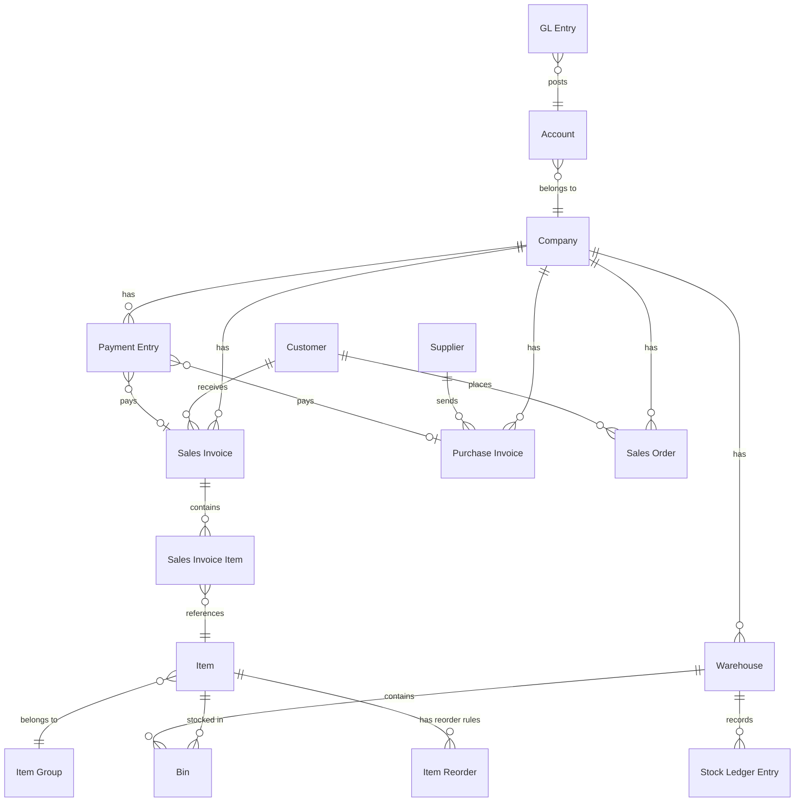

# Database Entity Map

## Title
Traders — Database Entity / DocType Map

## Purpose
Documents all database entities (ERPNext DocTypes and tables) accessed by the Traders application, where they are used, and through which layer.

**Referenced by:** [[SALES_LIFECYCLE_EXTENSION_DESIGN]] — new config-pack DocTypes (§2) extend this entity set

## Generated From
- `apps/trader_app/trader_app/api/dashboard.py` — SQL queries with `tab` prefixed tables
- `apps/trader_app/trader_app/api/inventory.py` — SQL queries
- `apps/trader_app/trader_app/api/reports.py` — SQL queries
- `frontend/trader-ui/src/lib/api.ts` — `resourceApi` doctype references
- `frontend/trader-ui/src/pages/*.tsx` — page-level doctype references
- `apps/trader_app/trader_app/hooks.py` — fixtures

## Last Audit Basis
All `frappe.db.sql` calls with `` `tabXxx` `` patterns; all `resourceApi.list({ doctype: '...' })` calls.

---

## Entity Inventory

### Core Business Entities

| DocType / Table | Backend Access | Frontend Access | Used By |
|---|---|---|---|
| **Company** | `frappe.defaults`, `frappe.get_cached_value`, `frappe.db.get_value` | — | `_get_default_company()` in all API modules |
| **Sales Invoice** | `frappe.db.sql` (dashboard, reports) | `resourceApi.list({ doctype: 'Sales Invoice' })` | DashboardPage, SalesPage, ReportsPage, FinancePage |
| **Sales Invoice Item** | `frappe.db.sql` (dashboard) | — | `get_sales_by_item_group()` |
| **Sales Order** | `frappe.db.sql` (dashboard) | — | `get_recent_orders()`, `_get_todays_order_count()` |
| **Purchase Invoice** | `frappe.db.sql` (dashboard, reports) | `resourceApi.list({ doctype: 'Purchase Invoice' })` | DashboardPage, PurchasesPage, ReportsPage, FinancePage |
| **Payment Entry** | `frappe.db.sql` (dashboard) | — | `get_cash_flow_summary()` |
| **Customer** | `frappe.db.count` (dashboard) | `resourceApi.list({ doctype: 'Customer' })` | DashboardPage, CustomersPage |
| **Supplier** | — | `resourceApi.list({ doctype: 'Supplier' })` | SuppliersPage |
| **Item** | `frappe.db.sql` (inventory) | — | InventoryPage (via inventory API) |
| **Item Reorder** | `frappe.db.sql` (inventory) | — | `get_low_stock_items()` |
| **Bin** | `frappe.db.sql` (dashboard, inventory) | — | DashboardPage, InventoryPage |
| **Warehouse** | `frappe.db.sql` (inventory) | — | InventoryPage |
| **Stock Ledger Entry** | `frappe.db.sql` (inventory) | — | `get_stock_movement()` (⚠️ not used by frontend) |
| **GL Entry** | `frappe.db.sql` (reports) | — | `get_profit_and_loss()` |
| **Account** | `frappe.db.sql` subquery (reports) | — | `get_profit_and_loss()` |

### System / Meta Entities

| DocType / Table | Usage |
|---|---|
| **User** | Authentication via `frappe.auth.get_logged_user`, demo generator |
| **Role** | Fixtures in `hooks.py`: Trader Admin, Trader Sales Manager, Trader Purchase Manager, Trader Accountant, Trader Warehouse Manager |
| **Custom Field** | Fixtures in `hooks.py`: fields matching `trader_%` |

### Demo-Only Entities

| DocType | Generator | Notes |
|---|---|---|
| **Stock Entry** | `InventoryGenerator` | Used during demo seeding for initial stock |
| **Delivery Note** | `SalesGenerator` | Created during demo seeding |
| **Purchase Receipt** | `PurchaseGenerator` | Created during demo seeding |
| **Journal Entry** | `FinancialGenerator` | Created during demo seeding |
| **Item Group** | `ItemGenerator` | Created during demo seeding |

---

## Entity Relationship Map

## Access Pattern Summary

| Access Pattern | Count | Examples |
|---|---|---|
| Direct SQL (`frappe.db.sql`) | 20+ queries | All custom API endpoints |
| Frappe ORM (`frappe.get_doc`, `frappe.db.get_value`) | ~5 calls | Company lookup, cache |
| Generic Resource API (frontend) | 4 DocTypes | Sales Invoice, Purchase Invoice, Customer, Supplier |
| Frappe count API | 1 | `frappe.client.get_count` |

## Findings

| ID | Finding | Severity |
|---|---|---|
| ENT-01 | `Stock Ledger Entry` is queried by `get_stock_movement()` but this endpoint is not called from the frontend | ⚠️ Medium |
| ENT-02 | No custom DocTypes created — fully relies on ERPNext standard DocTypes | 🔍 Architectural Note |
| ENT-03 | `Delivery Note` and `Purchase Receipt` are created by demo generators but not exposed through any custom API or frontend screen | ⚠️ Low |
| ENT-04 | `Sales Order` is only read (recent orders) but not managed (create/edit/delete) from the frontend | ⚠️ Medium |
