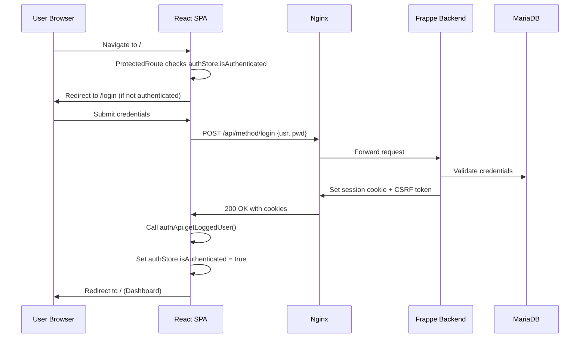

# Permission and Visibility Map

## Title
Traders — Permission and Visibility Architecture

## Purpose
Documents all permission controls, authentication guards, role definitions, and visibility rules across frontend and backend.

## Generated From
- `frontend/trader-ui/src/App.tsx` — `ProtectedRoute` component
- `frontend/trader-ui/src/stores/authStore.ts` — authentication state
- `frontend/trader-ui/src/lib/api.ts` — CSRF token and auth interceptors
- `apps/trader_app/trader_app/hooks.py` — role fixtures, permission config
- `apps/trader_app/trader_app/api/*.py` — `@frappe.whitelist()` decorators

## Last Audit Basis
All auth-related files in frontend and backend.

---

## Authentication Flow

## Frontend Guards

| Guard | Location | Mechanism | Protects |
|---|---|---|---|
| `ProtectedRoute` | `App.tsx` | Checks `authStore.isAuthenticated`; redirects to `/login` | All routes except `/login` |
| Auth interceptor | `lib/api.ts` | On 401/403 response, redirects to `/login` | All API calls |
| CSRF token | `lib/api.ts` | Reads `csrf_token` from cookie, sends in `X-Frappe-CSRF-Token` header | All API calls |

## Backend Guards

| Guard | Location | Mechanism | Protects |
|---|---|---|---|
| `@frappe.whitelist()` | All API endpoints | Requires authenticated session (not Guest) | All custom API endpoints |
| Frappe Resource API | Built-in | Requires authenticated session + DocType permissions | `/api/resource/*` CRUD |
| Frappe session | Built-in | Cookie-based session management | All `/api/*` endpoints |

## Role Definitions (from `hooks.py` fixtures)

| Role | Purpose | Status |
|---|---|---|
| `Trader Admin` | Full administrative access | ✅ Defined in fixtures |
| `Trader Sales Manager` | Sales module management | ✅ Defined in fixtures |
| `Trader Purchase Manager` | Purchase module management | ✅ Defined in fixtures |
| `Trader Accountant` | Finance and reporting access | ✅ Defined in fixtures |
| `Trader Warehouse Manager` | Inventory management | ✅ Defined in fixtures |

## Role-Based Visibility

| Screen | Required Role | Frontend Enforcement | Backend Enforcement |
|---|---|---|---|
| Dashboard (`/`) | Any authenticated | `ProtectedRoute` | `@frappe.whitelist()` |
| Sales (`/sales`) | Any authenticated | `ProtectedRoute` | Frappe DocType permissions |
| Purchases (`/purchases`) | Any authenticated | `ProtectedRoute` | Frappe DocType permissions |
| Inventory (`/inventory`) | Any authenticated | `ProtectedRoute` | `@frappe.whitelist()` |
| Customers (`/customers`) | Any authenticated | `ProtectedRoute` | Frappe DocType permissions |
| Suppliers (`/suppliers`) | Any authenticated | `ProtectedRoute` | Frappe DocType permissions |
| Finance (`/finance`) | Any authenticated | `ProtectedRoute` | `@frappe.whitelist()` |
| Reports (`/reports`) | Any authenticated | `ProtectedRoute` | `@frappe.whitelist()` |
| Settings (`/settings`) | Any authenticated | `ProtectedRoute` | ⚠️ No backend enforcement (UI-only) |
| Login (`/login`) | None (public) | No guard | `login` is public |

## Findings

| ID | Finding | Severity |
|---|---|---|
| PERM-01 | No role-based frontend visibility — all screens visible to all authenticated users | ⚠️ Medium |
| PERM-02 | Custom roles defined in fixtures but not enforced in frontend sidebar visibility | ⚠️ Medium |
| PERM-03 | Settings page has no backend persistence — changes are UI-only | ⚠️ High |
| PERM-04 | `has_permission` hook is commented out in `hooks.py` — no custom permission logic active | 🔍 Noted |
| PERM-05 | CRUD operations via `resourceApi` rely on Frappe's built-in DocType permissions (role-based) | ✅ Verified |
