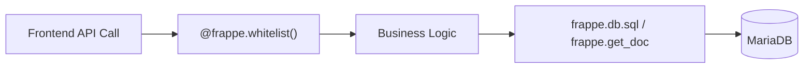

# Service Layer Map

## Title
Traders — Service Layer Architecture

## Purpose
Maps all business logic functions, their responsibilities, the entities they operate on, and their exposure to the frontend.

## Generated From
- `apps/trader_app/trader_app/api/dashboard.py`
- `apps/trader_app/trader_app/api/inventory.py`
- `apps/trader_app/trader_app/api/reports.py`
- `apps/trader_app/trader_app/hooks.py`
- `apps/trader_app/trader_app/demo/` (seed engine)
- `apps/trader_app/trader_app/setup/install.py`

## Last Audit Basis
Full scan of all Python files in `apps/trader_app/trader_app/`

---

## Service Architecture

The Traders backend uses a **flat service architecture** where API endpoint functions contain business logic directly (no separate service/repository layers). All data access is performed inline via `frappe.db.sql` or Frappe ORM methods.

---

## Dashboard Services (`api/dashboard.py`)

| Function | Type | Entities Accessed | Frontend Consumer |
|---|---|---|---|
| `get_dashboard_kpis()` | Whitelisted | Sales Invoice, Sales Order, Purchase Invoice, Bin, Customer, Company | `DashboardPage` via `dashboardApi.getKPIs()` |
| `get_sales_trend()` | Whitelisted | Sales Invoice | `DashboardPage` via `dashboardApi.getSalesTrend()` |
| `get_top_customers(limit)` | Whitelisted | Sales Invoice | `DashboardPage` via `dashboardApi.getTopCustomers()` |
| `get_recent_orders(limit)` | Whitelisted | Sales Order | `DashboardPage` via `dashboardApi.getRecentOrders()` |
| `get_sales_by_item_group()` | Whitelisted | Sales Invoice Item, Sales Invoice | `DashboardPage` via `dashboardApi.getSalesByItemGroup()` |
| `get_cash_flow_summary()` | Whitelisted | Payment Entry | `DashboardPage` via `dashboardApi.getCashFlowSummary()`, `FinancePage` |
| `_get_default_company()` | Helper | Company | Internal |
| `_get_todays_sales()` | Helper | Sales Invoice | Internal |
| `_get_monthly_revenue()` | Helper | Sales Invoice | Internal |
| `_get_outstanding_receivables()` | Helper | Sales Invoice | Internal |
| `_get_outstanding_payables()` | Helper | Purchase Invoice | Internal |
| `_get_stock_value()` | Helper | Bin | Internal |
| `_get_low_stock_count()` | Helper | Bin, Item Reorder | Internal |
| `_get_total_customers()` | Helper | Customer | Internal |
| `_get_todays_order_count()` | Helper | Sales Order | Internal |

## Inventory Services (`api/inventory.py`)

| Function | Type | Entities Accessed | Frontend Consumer |
|---|---|---|---|
| `get_stock_summary(warehouse)` | Whitelisted | Bin, Item, Warehouse | `InventoryPage` via `inventoryApi.getStockSummary()` |
| `get_low_stock_items(limit)` | Whitelisted | Bin, Item, Warehouse, Item Reorder | `InventoryPage` via `inventoryApi.getLowStockItems()` |
| `get_warehouse_stock(warehouse)` | Whitelisted | Bin, Item | Unused in current frontend ⚠️ |
| `get_stock_movement(...)` | Whitelisted | Stock Ledger Entry, Item | Unused in current frontend ⚠️ |
| `_get_default_company()` | Helper | Company | Internal |

## Report Services (`api/reports.py`)

| Function | Type | Entities Accessed | Frontend Consumer |
|---|---|---|---|
| `get_accounts_receivable(limit)` | Whitelisted | Sales Invoice | `ReportsPage` via `reportsApi.getAccountsReceivable()` |
| `get_accounts_payable(limit)` | Whitelisted | Purchase Invoice | `ReportsPage` via `reportsApi.getAccountsPayable()`, `FinancePage` |
| `get_profit_and_loss(from_date, to_date)` | Whitelisted | GL Entry, Account | `FinancePage` via `reportsApi.getProfitAndLoss()` |
| `get_receivable_aging_summary()` | Whitelisted | Sales Invoice | `FinancePage` via `reportsApi.getReceivableAgingSummary()` |
| `get_monthly_sales_report(year)` | Whitelisted | Sales Invoice | `ReportsPage` via `reportsApi.getMonthlySalesReport()` |
| `get_supplier_balances(limit)` | Whitelisted | Purchase Invoice | `ReportsPage` via `reportsApi.getSupplierBalances()` |
| `_get_default_company()` | Helper | Company | Internal |

## Frappe Generic Resource API (via `resourceApi`)

The frontend also uses Frappe's built-in REST resource API for CRUD operations:

| Operation | Frontend Method | Backend Handler |
|---|---|---|
| List documents | `resourceApi.list({ doctype, ... })` | `GET /api/resource/{doctype}` (Frappe built-in) |
| Get document | `resourceApi.get(doctype, name)` | `GET /api/resource/{doctype}/{name}` (Frappe built-in) |
| Create document | `resourceApi.create(doctype, data)` | `POST /api/resource/{doctype}` (Frappe built-in) |
| Update document | `resourceApi.update(doctype, name, data)` | `PUT /api/resource/{doctype}/{name}` (Frappe built-in) |
| Delete document | `resourceApi.delete(doctype, name)` | `DELETE /api/resource/{doctype}/{name}` (Frappe built-in) |
| Count documents | `resourceApi.count(doctype, filters)` | `GET /api/method/frappe.client.get_count` (Frappe built-in) |

## Auth Services (Frappe Built-in)

| Function | Endpoint | Frontend Consumer |
|---|---|---|
| Login | `POST /api/method/login` | `authStore.login()` via `authApi.login()` |
| Logout | `POST /api/method/logout` | `authStore.logout()` via `authApi.logout()` |
| Get logged user | `GET /api/method/frappe.auth.get_logged_user` | `authStore.checkAuth()` via `authApi.getLoggedUser()` |

## Demo / Seed Services (`demo/`)

| Generator | Entities Created | Order |
|---|---|---|
| `CompanyGenerator` | Company, Chart of Accounts | 1 |
| `UserGenerator` | User, Role assignments | 2 |
| `CustomerGenerator` | Customer | 3 |
| `SupplierGenerator` | Supplier | 4 |
| `ItemGenerator` | Item, Item Group | 5 |
| `InventoryGenerator` | Stock Entry, Bin | 6 |
| `PurchaseGenerator` | Purchase Invoice, Purchase Receipt | 7 |
| `SalesGenerator` | Sales Invoice, Sales Order, Delivery Note | 8 |
| `PaymentGenerator` | Payment Entry | 9 |
| `FinancialGenerator` | Journal Entry, GL Entry | 10 |

## Setup Services

| Function | Purpose |
|---|---|
| `after_install` | Post-installation hook for app setup |

---

## Findings

| ID | Finding | Severity |
|---|---|---|
| SVC-01 | `get_warehouse_stock()` and `get_stock_movement()` are whitelisted but not called from frontend | ⚠️ Medium |
| SVC-02 | No separate service/repository layer — business logic is inline in API handlers | 🔍 Architectural Note |
| SVC-03 | `_get_default_company()` is duplicated across all 3 API modules | ⚠️ Low |
