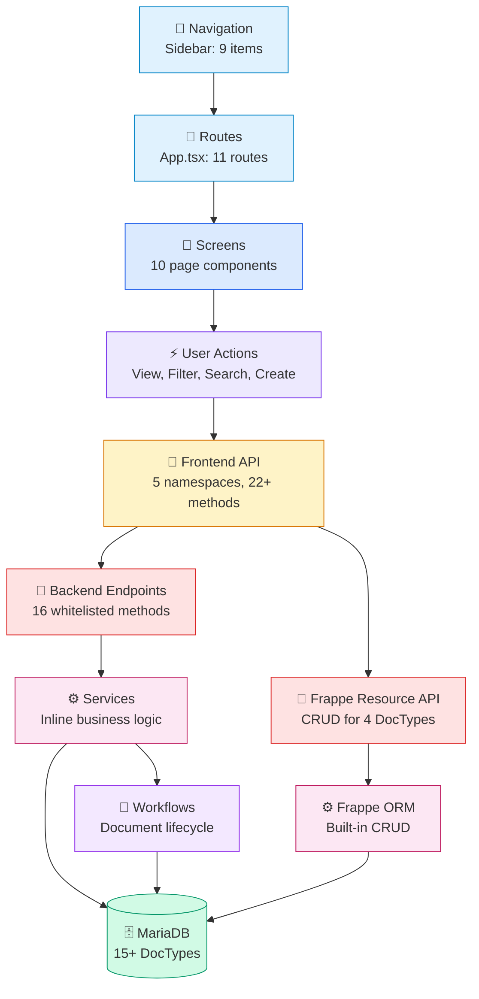
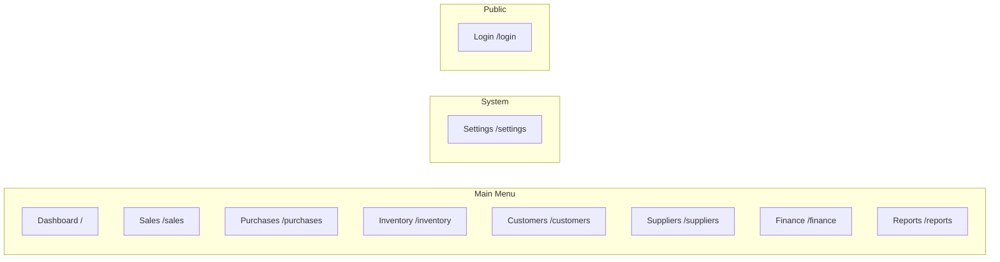
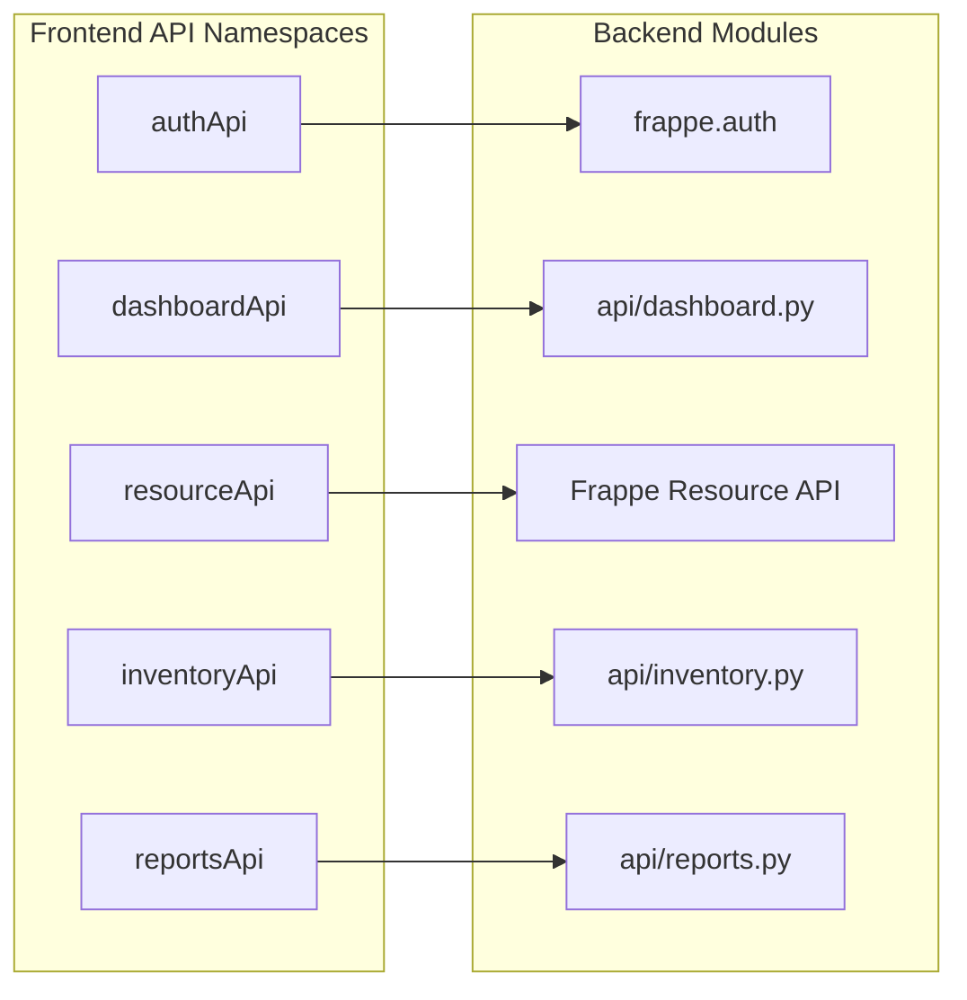

# ERP System Graph

## Title
Traders — Top-Level System Architecture Graph

## Purpose
Visual representation of the complete system architecture showing the flow from user navigation through to database entities.

## Generated From
Full architecture audit scan of all frontend and backend source files.

## Last Audit Basis
All routes, navigation, API calls, backend endpoints, services, and entities.

---

## Overall Architecture Flow

## Layer Detail

### Navigation Layer

### API Communication Layer

