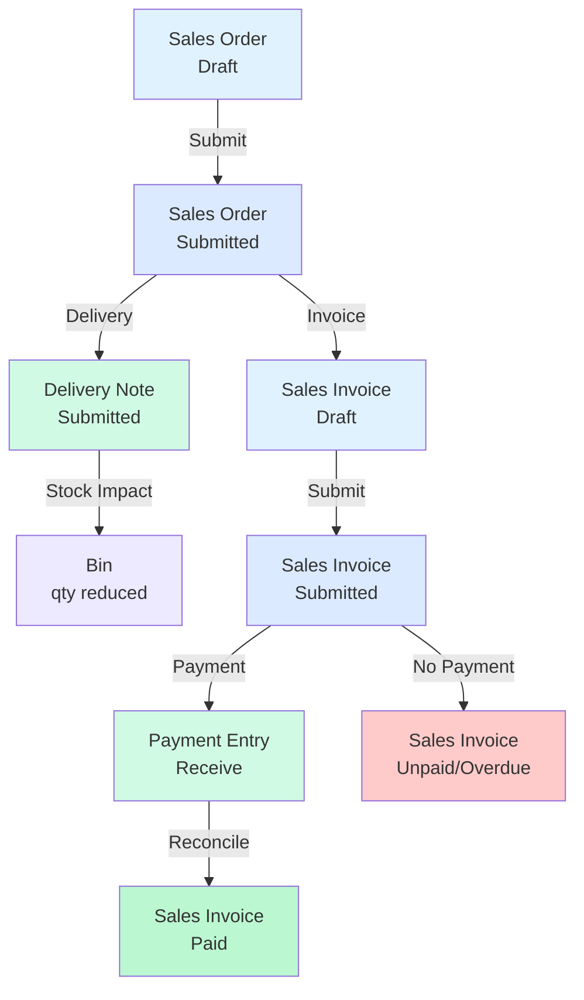
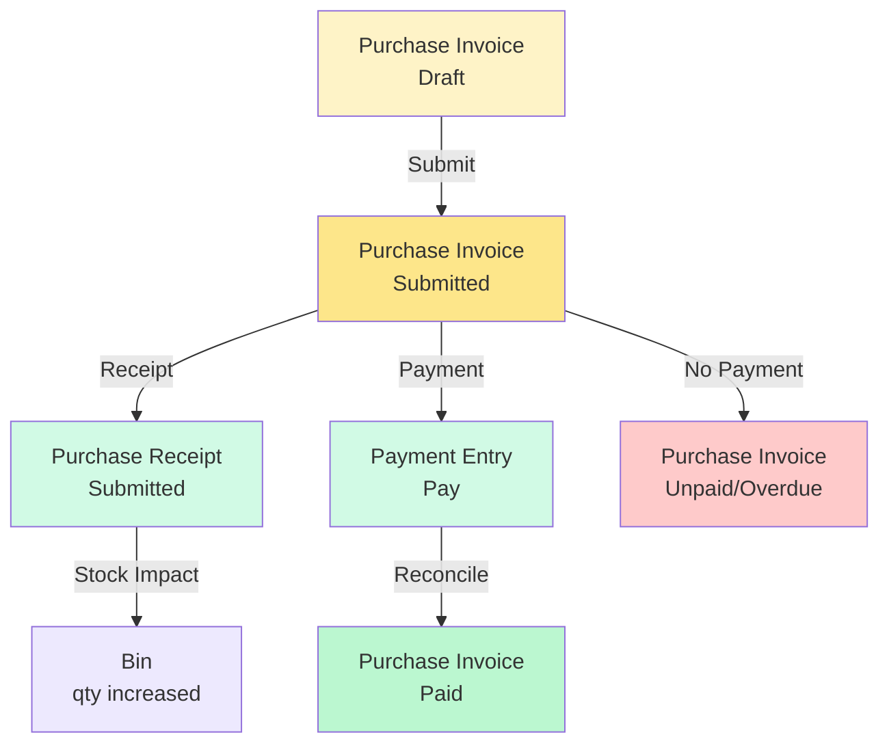
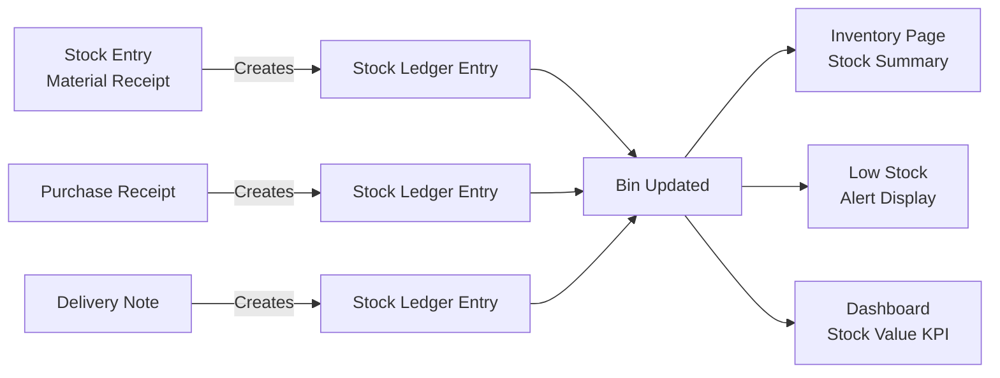
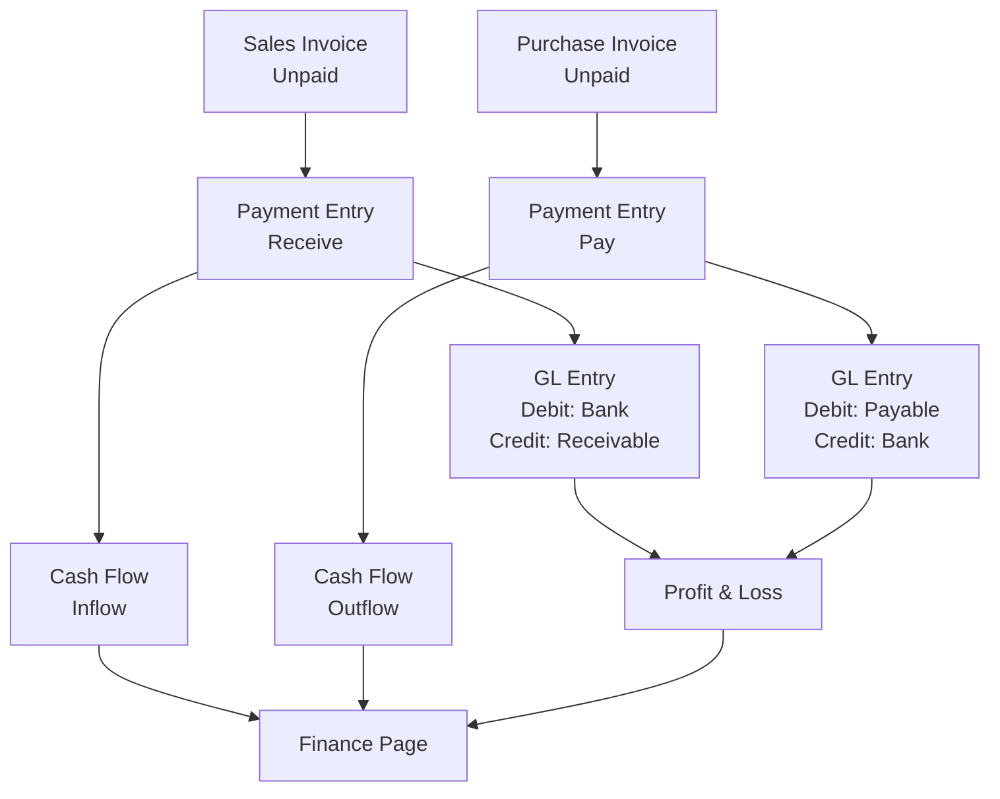
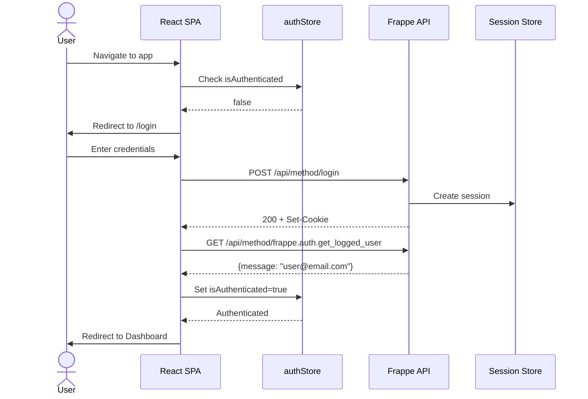

# Workflow Graphs

## Title
Traders — Business Workflow Diagrams

## Purpose
Visualizes end-to-end business workflows showing document lifecycle, data flow, and system interactions.

## Generated From
Workflow scanner analysis of backend queries, frontend status handling, and demo generator patterns.

## Last Audit Basis
All API endpoints, page components, and hooks configuration.

---

## Sales End-to-End Flow

### Sales Workflow — UI Coverage

| Step | Frontend Screen | Backend Endpoint | Status |
|---|---|---|---|
| Create Sales Order | ❌ Not available | resourceApi (Frappe) | ⚠️ Missing |
| View Sales Orders | DashboardPage (recent) | get_recent_orders | ✅ Read-only |
| Create Sales Invoice | ❌ Button exists, no handler | resourceApi (Frappe) | ⚠️ Missing |
| View Sales Invoices | SalesPage | resourceApi.list | ✅ |
| Submit Invoice | ❌ Not available | Frappe workflow | ⚠️ Missing |
| Record Payment | ❌ Not available | Payment Entry | ⚠️ Missing |
| View Receivables | ReportsPage, FinancePage | get_accounts_receivable | ✅ |

## Purchase End-to-End Flow

## Inventory Movement Flow

## Payment Reconciliation Flow

## Authentication Flow

