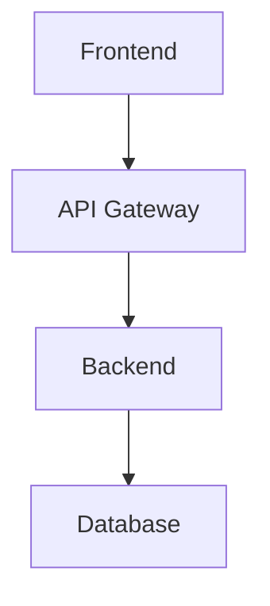

# Documentation Standards

## Purpose

Define documentation standards for enterprise software projects, suitable for both human developers and AI coding agents.

**Last Verified**: June 2026

---

## Documentation Types

| Document | Purpose | Audience | Frequency |
|---|---|---|---|
| README | Project overview and setup | All | On creation, updated monthly |
| Architecture Overview | System design | Developers, Architects | On major changes |
| Repository Context | Codebase understanding | AI agents, New devs | On major changes |
| PRD | Product requirements | Product, Dev | Per feature |
| Technical Spec | Implementation plan | Developers | Per feature |
| API Documentation | API reference | Frontend, Consumers | Every API change |
| Database Docs | Schema reference | Developers | Every schema change |
| ADR | Architecture decisions | Developers | Per decision |
| Runbook | Operational procedures | Operations | Per system |
| Incident Report | Incident documentation | All | Per incident |

---

## Documentation Principles

### 1. Documentation Lives with Code

Store documentation in the repository, close to the code it describes.

```
src/
  modules/
    orders/
      README.md              # Module documentation
      orders.controller.ts
      orders.service.ts
```

### 2. Single Source of Truth

Don't duplicate information. Reference the source.

- API docs generated from code (OpenAPI)
- Database docs from schema (Prisma)
- Type docs from TypeScript

### 3. Audience-Aware

Write for the reader. Different documents serve different audiences.

### 4. Actionable

Documentation should enable action. "How to" > "What is".

### 5. Current or Deleted

Outdated documentation is worse than no documentation. Keep it current or remove it.

---

## File Naming Conventions

| Type | Convention | Example |
|---|---|---|
| README | `README.md` | `README.md` |
| Module docs | `README.md` in module dir | `src/modules/orders/README.md` |
| Guides | `kebab-case.md` | `deployment-guide.md` |
| Templates | `{type}-template.md` | `prd-template.md` |
| ADRs | `NNNN-title.md` | `0001-use-postgresql.md` |

---

## Markdown Standards

### Headings

```markdown
# Document Title (H1 - one per document)
## Major Section (H2)
### Subsection (H3)
#### Detail (H4 - rarely needed)
```

### Code Blocks

Always specify language:

````markdown
```typescript
const x = 1;
```

```sql
SELECT * FROM users;
```

```bash
pnpm install
```
````

### Tables

Use for structured data:

```markdown
| Column | Description | Type |
|---|---|---|
| id | Primary key | UUID |
| name | Display name | VARCHAR(100) |
```

### Links

Use relative links within the repository:

```markdown
See [Architecture Overview](../architecture/full-stack-architecture.md)
```

### Diagrams

Use ASCII diagrams or Mermaid:

````markdown

````

---

## Required Sections

Every major document should include:

```markdown
# Title

## Purpose
{Why this document exists}

**Last Verified**: {Date}

---

## Content
{Main content}

---

## Anti-Patterns
{What to avoid}

---

## Verification Checklist
- [ ] {Item}
```

---

## Documentation Locations

```
project-root/
  README.md                          # Project overview
  CONTRIBUTING.md                    # Contribution guide
  CHANGELOG.md                       # Release notes
  
  docs/
    architecture.md                  # Architecture overview
    database.md                      # Database documentation
    api.md                           # API documentation
    deployment.md                    # Deployment guide
    
    decisions/                       # ADRs
      0001-use-postgresql.md
      0002-use-nestjs.md
    
    runbooks/                        # Operational runbooks
      database-backup.md
      incident-response.md
  
  src/
    modules/
      orders/
        README.md                    # Module documentation
```

---

## Anti-Patterns

- **Outdated docs**: Update or delete
- **Docs without code examples**: Include practical examples
- **Overly verbose**: Be concise
- **Missing audience context**: Know your reader
- **Docs in wiki only**: Keep docs with code
- **No versioning**: Track documentation changes with code

---

## Verification Checklist

- [ ] README exists and is current
- [ ] Architecture overview exists
- [ ] API documentation generated
- [ ] Database documentation current
- [ ] Environment variables documented
- [ ] Deployment guide exists
- [ ] ADRs for major decisions
- [ ] Runbooks for operations
